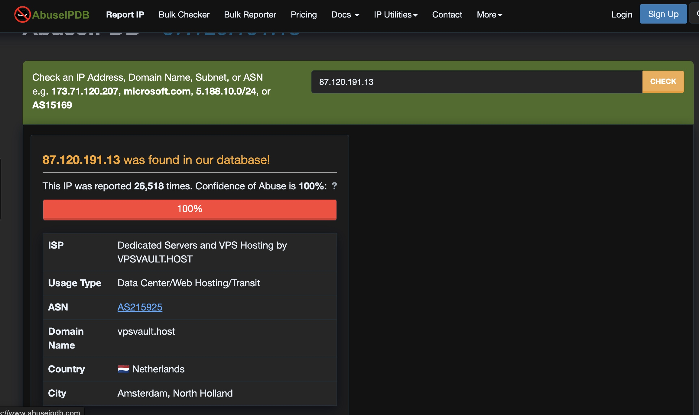
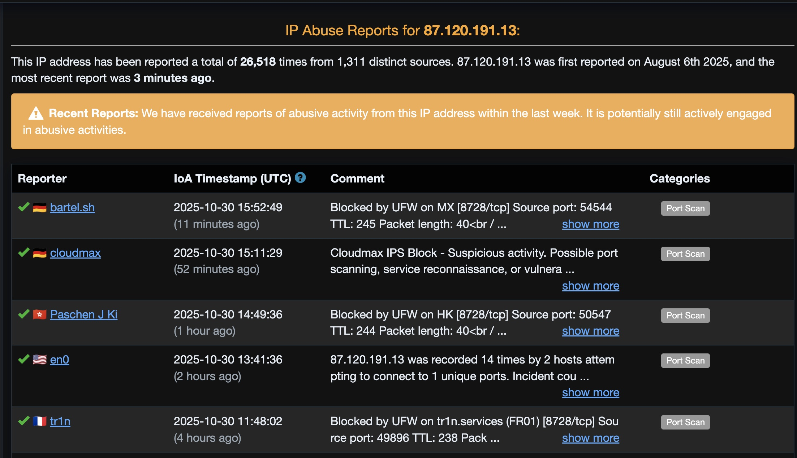
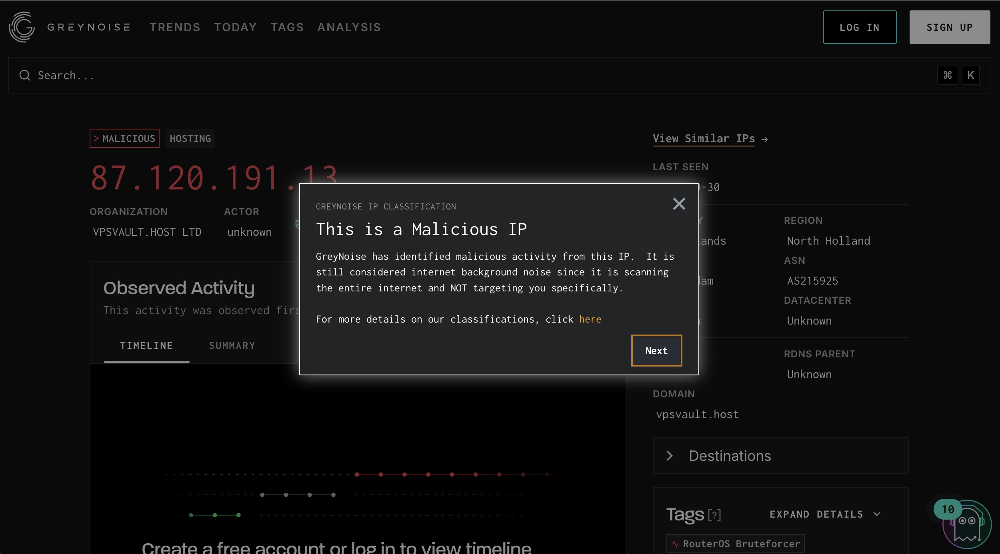
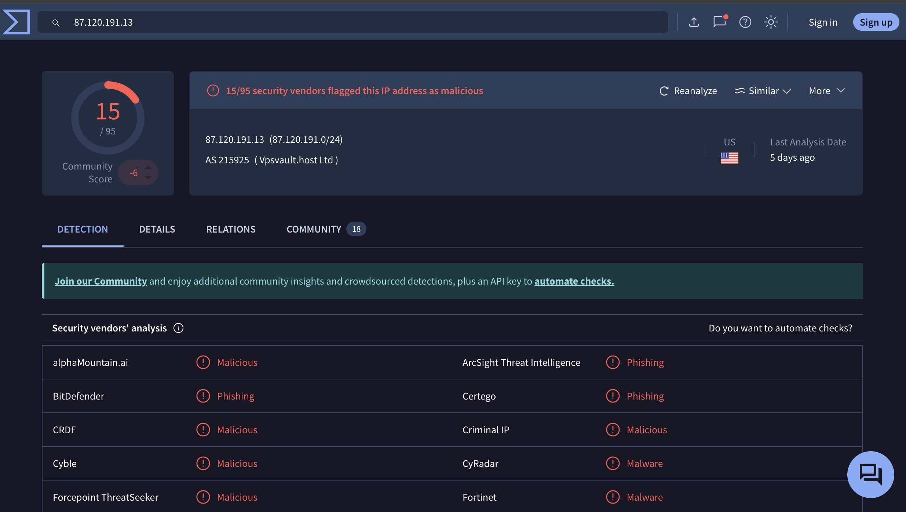

# Security Incident Report

## Incident #1 - MikroTik RouterOS Bruteforce Campaign

### Executive Summary
- **Date/Time:** 2025-10-30 11:54:19 UTC  
- **Source IP:** 87.120.191.13  
- **Country:** Netherlands (Amsterdam, North Holland)  
- **Honeypot:** Honeytrap  
- **Port Targeted:** 8728 (MikroTik RouterOS Admin API)  
- **Total Hits:** 15  
- **Threat Level:** 🔴 **HIGH**

---

## Initial Detection

Multiple connection attempts to port 8728 detected from a single source IP over several minutes. Port 8728 is the default MikroTik RouterOS administrative API port, indicating the attacker is scanning for vulnerable routers to compromise.

---

## Threat Intelligence Investigation

### AbuseIPDB Analysis

- **Abuse Confidence Score:** 100% (maximum threat level)
- **Total Reports:** 26,518 reports from 1,311 distinct sources
- **First Seen:** August 6, 2025
- **Most Recent Report:** 3 minutes ago (actively attacking)
- **ISP:** VPSVAULT.HOST (AS215925)
- **Primary Category:** Port Scanning (targeting port 8728)
- **Status:** ⚠️ **ACTIVELY ENGAGED** in abusive activities within last week

### GreyNoise Analysis

- **Classification:** MALICIOUS
- **Behavior:** Mass internet scanner targeting RouterOS systems
- **Tag:** "RouterOS Bruteforcer"
- **Note:** Scanning entire internet, not targeted specifically at us

### VirusTotal Analysis

- **Detection Rate:** 15/95 security vendors flagged as malicious
- **Community Score:** -6 (negative reputation)
- **Vendor Detections:**
  - alphaMountain.ai: Malicious
  - BitDefender: Phishing
  - CRDF: Malicious
  - Cyble: Malicious
  - Forcepoint ThreatSeeker: Malicious
  - Criminal IP: Malicious
  - CyRadar: Malware
  - Fortinet: Malware

---

## Attack Pattern Analysis

This IP is part of a coordinated botnet campaign specifically targeting MikroTik routers. The attacker is attempting to exploit known vulnerabilities or default credentials on RouterOS devices. Based on AbuseIPDB reports, this IP has been hitting thousands of targets globally for months.

---

## Classification

| Attribute | Value |
|-----------|-------|
| **Attack Type** | RouterOS Exploitation Attempt / Botnet Activity |
| **Threat Level** | HIGH - Known malicious actor with 100% abuse confidence, actively attacking multiple targets |
| **TTPs** | MITRE ATT&CK T1046 (Network Service Discovery) + T1110 (Brute Force) |

---

## Recommended Actions

1. ✅ **Block IP immediately** at perimeter firewall (87.120.191.13)
2. ✅ **Block entire ASN** if persistent attacks continue (AS215925 - VPSVAULT.HOST)
3. 🔍 **Hunt internally** for any MikroTik devices on network and ensure they're patched
4. 🔍 **Check logs** for any successful connections from this IP or related IPs
5. 📊 **Add to threat intelligence feeds** for correlation with future attacks
6. ⚠️ **Alert network team** about RouterOS-specific threat campaign

---

## Indicators of Compromise (IOCs)

| Indicator Type | Value |
|----------------|-------|
| **IP Address** | 87.120.191.13 |
| **ASN** | AS215925 (Vpsvault.host Ltd) |
| **Targeted Port** | 8728/TCP |
| **Campaign Tag** | RouterOS Bruteforcer |
| **Threat Actor** | Mass scanning botnet (automated) |

---

## Additional Context

### Understanding AS/ASN

**AS (Autonomous System) Number = ASN (Autonomous System Number)** - same thing, different abbreviations.

**AS215925** = The network block owned by Vpsvault.host Ltd (a VPS hosting company)

#### What this tells you:
- The attacker is using a rented VPS server from VPSVAULT.HOST
- Either the VPS was compromised OR rented by bad actors for scanning
- Cheap VPS providers like this are popular for botnets because:
  - Easy to rent with crypto/anonymous payment
  - Can spin up many IPs quickly
  - Often have poor abuse policies

#### Why it matters for SOC work:
- You can block the entire ASN if you see multiple IPs from same provider attacking
- Helps identify patterns: "All attacks today came from AS215925, likely same threat actor"
- Some organizations preemptively block high-risk ASNs

---

## Notes

This is a well-known malicious IP participating in a long-running campaign against MikroTik routers globally. The source is a compromised or rented VPS from VPSVAULT.HOST being used for malicious scanning. The 100% abuse confidence score and 26,000+ reports indicate this is a serious threat actor. The fact that it was reported "3 minutes ago" shows this campaign is currently active and ongoing.

---

## Report Metadata

- **Generated:** 2025-10-30  
- **Analyst:** Aryan Vij 
- **Distribution:** Internal Use Only
